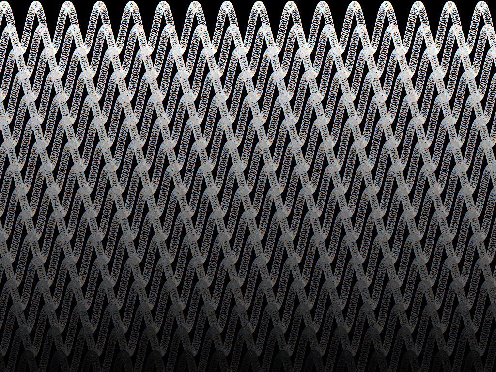

# Sine Surfer

A simple screensaver for [Haiku](https://www.haiku-os.org/) made for the [Google Code-In contest](https://codein.withgoogle.com/dashboard/).



## Usage

### Building

Build the screensaver by running `make` in the `src` directory.

```bash
# Assuming your current directory is the root of the repo
cd src; make
```

### Installation

Install the screensaver by navigating to your `objects.ARCH-ccX-release` directory and copying the `Sine Surfer` binary to `/boot/system/non-packaged/add-ons/Screen Savers`.

```bash
# Assuming your current directory is src relative to the root of the repo
cd objects.*; cp "Sine Surfer" "/boot/system/non-packaged/add-ons/Screen Savers"
```

## Special thanks to

 * [@alwayslivid](https://github.com/alwayslivid) for his [Work In Motion](https://github.com/alwayslivid/WorkInMotion) screensaver source code which I could use as a template.
